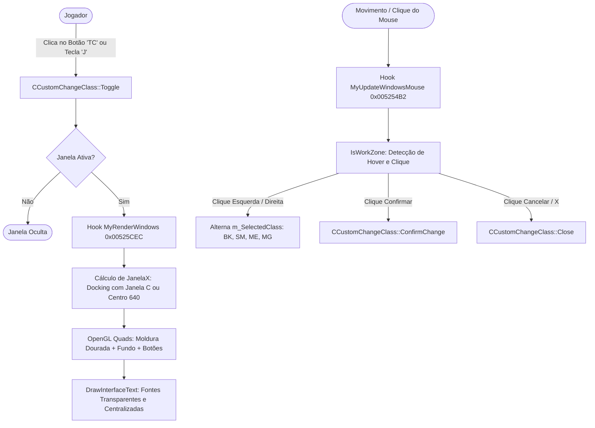

# Custom: Troca de Classe via Interface (Change Class System) - Fase 1: Interface & Protótipo Interativo

> **Documentação Técnica Oficial de Customização - CMZone / SSeMU 97k 2K26**  
> **Versão / Base:** UPDATE CMZ 17 (3.1.7) 28-09-26 / Kayito  
> **Data de Criação:** 2026-09-28  
> **Autor / Adaptador:** CMZone  
> **Status:** Fase 1 Concluída (Interface OpenGL, Navegação Carrossel e Renderizador de Texto Validados)  

---

## 1. Visão Geral e Propósito

Esta customização implementa um sistema in-game de **Troca de Classe** (Change Class) acessível por interface gráfica interativa diretamente dentro do cliente `Main.dll`. 

Diferente de sistemas legados que dependiam exclusivamente de comandos de chat (ex: `/virarbk`, `/virarsm`), o sistema proporciona uma experiência visual moderna e intuitiva:
1. **Botão de Acesso "TC"**: Integrado perfeitamente na Janela de Status do Personagem (tecla **"C"**), posicionado no canto inferior direito (`X = 578, Y = 390`), espelhando geometricamente o botão nativo de fechar `[X]`.
2. **Atalho de Teclado**: Abertura rápida através da tecla de atalho **"J"**.
3. **Janela Flutuante Independente**: Janela renderizada em espaço virtual `640x480`, com detecção inteligente de abertura: se a Janela "C" estiver aberta, o painel se posiciona automaticamente à sua esquerda com margem de segurança de 10px; se estiver fechada, posiciona-se perfeitamente no centro da tela.
4. **Carrossel de Classes (97k Estrito)**: Exclusão do Dark Lord (inexistente na versão 97k) e foco nas 4 classes Quest Level 2:
   - **Blade Knight (BK)** - Código: 17
   - **Soul Master (SM)** - Código: 1
   - **Muse Elf (ME)** - Código: 33
   - **Magic Gladiator (MG)** - Código: 48
5. **Navegação Interativa**: Navegação circular com botões laterais `<` e `>`, caixa de pré-visualização de avatar centralizada e barra de identificação da classe selecionada.
6. **Avisos e Requisitos**: Exibição clara de regras in-game (apenas para VIPs e obrigatoriedade de desequipar todos os itens antes da troca).
7. **Botões de Ação com Feedback Visual**: Botões `CONFIRMAR` (verde floresta) e `CANCELAR` (bordô escuro) com realce dinâmico em estado de hover.

---

## 2. Arquitetura da Interface (Fase 1 - OpenGL Nativo)

A Fase 1 foi projetada para criar um protótipo operacional completo com renderização via **OpenGL nativo**, garantindo geometria precisa, resposta tátil dos cliques e validação do fluxo de usuário antes da introdução de texturas externas `.ozj` / `.ozt`.



---

## 3. Modificações na Source do Client (Main) - Fase 1

### Arquivos Criados:
* `Source\Main_097K-KOR\Main\CustomChangeClass.h`: Declaração da classe `CCustomChangeClass`, estrutura `CHANGE_CLASS_INFO` e protótipos de manipulação.
* `Source\Main_097K-KOR\Main\CustomChangeClass.cpp`: Implementação dos hooks, pipeline de renderização OpenGL, controle de mouse e lógica do carrossel.

### Arquivos Alterados:
* `Source\Main_097K-KOR\Main\Main.cpp`: Chamada de `gCustomChangeClass.Init()` e inclusão do atalho `'J'` em `KeyboardProc`.
* `Source\Main_097K-KOR\Main\Main.vcxproj` e `Main.vcxproj.filters`: Registro dos novos arquivos no build system do MSBuild.

---

## 4. Offsets Nativas, Hooks e Engenharia Reversa

| Endereço (Offset) | Tipo | Descrição Técnica |
| :---: | :---: | :--- |
| `0x00525CEC` | **Hook CALL (0xE8)** | Ponto de interceptação dentro do loop principal de renderização de janelas (`RenderWindows`). Garante que a interface seja desenhada sobre a UI nativa no momento correto. |
| `0x005254B2` | **Hook CALL (0xE8)** | Ponto de interceptação da atualização de eventos de mouse das janelas (`UpdateWindowsMouse`). Processa cliques antes do clique vazar para o cenário 3D. |
| `0x00514270` | **Função Nativa** | `DrawInterfaceText(int xCenter, int y, char* text)`: Mede o texto no HDC do GDI e converte dinamicamente a largura real para coordenadas virtuais 640x480 (`(sz.cx * 640) / WindowWidth`), centralizando perfeitamente no ponto `xCenter`. |
| `0x0047F650` | **Função Nativa** | `RenderText(int x, int y, char* text, int width, int sort, SIZE* size)`: Renderizador base de texto da Webzen. |
| `0x0040F6F7` | **Rotina Interna** | Loop de rasterização de glifos da Webzen no buffer de textura: pixels do caractere recebem `SetTextColor` e pixels fora recebem `SetBackgroundTextColor`. |
| `0x00559C78` | **Variável Nativa** | `SetTextColor` (DWORD RGBA Little-Endian): Cor primária do texto. |
| `0x00559C80` | **Variável Nativa** | `SetBackgroundTextColor` (DWORD RGBA Little-Endian): Cor de fundo do bloco de texto. |
| `0x00511680` | **Função Nativa** | `EnableAlphaTest(bool)`: Ativa/desativa teste de transparência alfa no pipeline OpenGL. |
| `0x00511600` | **Função Nativa** | `DisableAlphaBlend()`: Desativa mistura alfa ao concluir renderizações. |
| `0x004C3530` | **Função Original** | Rotina padrão de renderização de janelas do client (`RenderWindows`). |
| `0x004ECB00` | **Função Original** | Rotina padrão de processamento de mouse das janelas (`UpdateWindowsMouse`). |
| `0x0047FAE0` | **Função Nativa** | `CreateNotice(char* text, int color)`: Disparo de mensagens de aviso nativas na tela. |
| `0x0047F7F0` | **Função Nativa** | `pRenderTipText(int x, int y, char* text)`: Renderização da caixa de tooltip nativa. |
| `0x00559C84` | **Variável Nativa** | `InputEnable`: Sinalizador de campo de chat ativo (previne acionamento de atalhos durante digitação). |
| `0x07D7BE6C` | **Variável Nativa** | `CharacterOpened` (int): Flag indicando se a Janela de Status "C" está aberta (1) ou fechada (0). |
| `0x055CA00C` | **Variável Nativa** | `g_hFont` (HFONT): Fonte normal da interface. |
| `0x055CA010` | **Variável Nativa** | `g_hFontBold` (HFONT): Fonte negrito da interface. |
| `0x055CA014` | **Variável Nativa** | `g_hFontBig` (HFONT): Fonte grande/títulos da interface. |
| `0x055C9FEC` | **Variável Nativa** | `m_hFontDC` (HDC): Device Context GDI para medição de fontes. |

---

## 5. Soluções de Engenharia Aplicadas

### 5.1. Eliminação do Fundo Preto dos Textos (100% Transparente)
* **Diagnóstico**: O rasterizador de fontes da Webzen (`0x0040F6F7` -> `0x0040F70C`) copia o valor de `SetBackgroundTextColor` (`0x00559C80`) para todos os pixels que não fazem parte do glifo do caractere. Quando outras rotinas deixavam esse valor como `0x80000000` (preto translúcido), uma caixa preta cobria os botões coloridos e o fundo da janela.
* **Solução**:
  ```cpp
  SelectObject(m_hFontDC, font);
  SetBackgroundTextColor = 0; // Alpha = 0 (Totalmente Transparente)
  SetTextColor = color;
  ```
  Ao combinar `SetBackgroundTextColor = 0;` com `EnableAlphaTest(true);`, o teste alfa do OpenGL descarta automaticamente qualquer pixel cujo canal Alfa seja `0`, deixando os textos completamente limpos e transparentes.

### 5.2. Alinhamento e Centralização Dinâmica em Widescreen
* **Diagnóstico**: Em resoluções widescreen (ex: 1366x768, 1920x1080), as chamadas GDI de `GetTextExtentPoint32A` retornam dimensões em pixels reais do monitor, enquanto a interface 2D opera no espaço fixo de coordenadas virtuais `640x480`. Cálculos manuais diretos provocavam deslocamento severo dos textos para a esquerda.
* **Solução**: Uso da rotina nativa `DrawInterfaceText(centerX, y, (char*)text)`:
  ```cpp
  int centerX = x + (w / 2);
  DrawInterfaceText(centerX, y, (char*)text);
  ```
  A função nativa realiza a fórmula exata:
  $$\text{LarguraVirtual} = \frac{\text{LarguraPixelsReais} \times 640}{\text{WindowWidth}}$$
  $$\text{PosicaoX} = \text{CentroX} - \frac{\text{LarguraVirtual}}{2}$$
  Garantindo centralização em qualquer proporção de tela ou resolução.

### 5.3. Macro de Cores RGBA para OpenGL Little-Endian
* Corrigida inversão dos canais Red e Blue:
  ```cpp
  #ifndef RGBA_TEXT
  #define RGBA_TEXT(r, g, b, a) (((DWORD)(a) << 24) | ((DWORD)(b) << 16) | ((DWORD)(g) << 8) | ((DWORD)(r)))
  #endif
  ```

---

## 6. Coordenadas e Geometria da Janela (Espaço Virtual 640x480)

```
+-----------------------------------------------------------+ [X] (closeX = JanelaX + 208, Y = 89, 18x18)
|                     TROCAR DE CLASSE                      | (Header: JanelaY = 85, Altura = 26)
+-----------------------------------------------------------+
|                                                           |
|     +----+           +-----------------+          +----+  |
|     |    |           |                 |          |    |  |
|     |  < |           |     [ BK ]      |          |  > |  | (Avatar Box: 84x84, boxY = 121)
|     |    |           |   Avatar Face   |          |    |  | (Setas: 26x34, arrowY = 146)
|     +----+           +-----------------+          +----+  |
|                                                           |
|             +----------------------------------+          |
|             |           Blade Knight           |          | (Name Bar: 186x22, nameY = 213)
|             +----------------------------------+          |
|                                                           |
|             A troca de classe e apenas para VIP           | (infoY = 247)
|          VIP possui vantagens e mantem o servidor         | (infoY = 263)
|          Desequipe todos os itens antes de trocar         | (infoY = 279)
|                                                           |
|    +--------------------+       +--------------------+    |
|    |     CONFIRMAR      |       |      CANCELAR      |    | (Botões Ação: 95x26, Y = 315)
|    +--------------------+       +--------------------+    |
+-----------------------------------------------------------+ (Altura Total = 270)
```

| Elemento | X | Y | Largura (W) | Altura (H) | Detalhes Visuais |
| :--- | :---: | :---: | :---: | :---: | :--- |
| **Janela Principal** | 210 (docked) / 205 (livre) | 85 | 230 | 270 | Borda dourada, fundo grafite semitransparente |
| **Barra de Título** | JanelaX | 85 | 230 | 26 | Fundo escurecido com divisor dourado |
| **Botão Fechar [X]** | JanelaX + 208 | 89 | 18 | 18 | Vermelho com hover brilhante |
| **Quadro do Avatar** | JanelaX + 73 | 121 | 84 | 84 | Moldura dourada e centro preto absoluto |
| **Seta Esquerda [<]** | JanelaX + 22 | 146 | 26 | 34 | Botão com borda metálica e hover dourado |
| **Seta Direita [>]** | JanelaX + 182 | 146 | 26 | 34 | Botão com borda metálica e hover dourado |
| **Barra de Nome** | JanelaX + 22 | 213 | 186 | 22 | Moldura dourada com texto ouro brilhante |
| **Texto Aviso 1** | JanelaX | 247 | 230 | - | Branco suave (`RGBA 225, 225, 225`) |
| **Texto Aviso 2** | JanelaX | 263 | 230 | - | Cinza suave (`RGBA 190, 190, 190`) |
| **Texto Aviso 3** | JanelaX | 279 | 230 | - | Coral alerta (`RGBA 255, 140, 100`) |
| **Botão Confirmar** | JanelaX + 15 | 315 | 95 | 26 | Borda verde vibrante, preenchimento floresta |
| **Botão Cancelar** | JanelaX + 120 | 315 | 95 | 26 | Borda carmim, preenchimento bordô escuro |
| **Botão Status "TC"**| 578 | 390 | 24 | 24 | Integrado na janela "C", espelho do botão [X] |

---

## 7. Protocolo de Rede e Pacotes (Implementado)

A confirmação do jogador na interface gráfica do cliente (`Main.dll`) envia a requisição segura diretamente ao GameServer via pacote com subcódigo dedicado:

| Pacote | Direção | HeadCode | SubCode | Tamanho | Descrição |
| :--- | :---: | :---: | :---: | :---: | :--- |
| `PMSG_CUSTOM_CHANGE_CLASS_REQ` | Client -> GS | 0xF3 | 0xE5 | 5 Bytes | Envia o código da nova classe solicitada |
| `PMSG_CUSTOM_CHANGE_CLASS_ANS` | GS -> Client | 0xF3 | 0xE5 | 5 Bytes | Retorna o status de sucesso ou erro |

### Estruturas C++ Alinhadas (Client & GameServer):
```cpp
#pragma pack(push, 1)
struct PMSG_CUSTOM_CHANGE_CLASS_REQ
{
	PSBMSG_HEAD h; // C1:F3:E5 (4 bytes)
	BYTE TargetClass; // 17 (BK), 1 (SM), 33 (ME), 48 (MG) (1 byte)
};

struct PMSG_CUSTOM_CHANGE_CLASS_ANS
{
	PSBMSG_HEAD h; // C1:F3:E5 (4 bytes)
	BYTE Result; // 0 = Sucesso, 1 = Falha (1 byte)
};
#pragma pack(pop)
```
* Observação de arquitetura: O subcódigo `0xE5` foi selecionado para garantir isolamento total e prevenir sobreposição com `0xE0` (`GCNewCharacterInfoSend`).


---

## 8. Modificações no GameServer / MuServer (Fase 2 - Implementada)

1. **Validações de Segurança Executadas no GameServer**:
   - Validação se o sistema está ativo (`m_CustomChangeClassSwitch == 1`).
   - Validação se o jogador é VIP (`lpObj->AccountLevel > 0`, configurável via `CustomChangeClassRequireVip`).
   - Validação de inventário: verificação dos slots 0 a 11 (`INVENTORY_WEAR_SIZE`). Se houver itens equipados, a troca é bloqueada com aviso.
   - Validação de estado do personagem: bloqueio durante trade, baú aberto, loja pessoal, morte/regen ou teleporte.
   - Verificação de classe atual: previne troca para a mesma classe já ativa.
   - Suporte a custo em Zen (`CustomChangeClassReqMoney`) e nível mínimo (`CustomChangeClassMinLevel`).

2. **Mecanismo de Execução e Transição**:
   - **Devolução de Pontos de Atributos**:
     Calcula os pontos excedentes alocados na classe anterior (`(Strength - baseStr) + (Dexterity - baseAgi) + ...`) e devolve com precisão matemática para `lpObj->LevelUpPoint`, permitindo que o jogador redistribua os pontos na nova classe sem perda ou duplicação.
   - **Atualização de Classe**:
     - `lpObj->DBClass = targetClass` (BK=17, SM=1, ME=33, MG=48)
     - `lpObj->Class = targetClass / 16`
     - `lpObj->ChangeUp = targetClass % 16`
     - Atributos base atualizados para os valores padrão da nova classe via `gDefaultClassInfo`.
   - **Tratamento de Habilidades (Skills)**:
     - Varredura da lista `lpObj->Skill` descartando magias incompatíveis com a nova classe através de `gSkillManager.CheckSkillRequireClass`.
     - Envio de lista atualizada ao cliente via `gSkillManager.GCSkillListSend(lpObj)`.
   - **Atualização de Quests**:
     - Marca as quests de evolução 1 e 2 como concluídas para BK, SM e ME.
     - Envio do status via `gQuest.GCQuestInfoSend(lpObj->Index)`.
   - **Sincronização em Tempo Real**:
     - Recálculo de atributos: `gObjectManager.CharacterCalcAttribute(lpObj->Index)`.
     - Atualização de charset: `gObjectManager.CharacterMakePreviewCharSet(lpObj->Index)`.
     - Envio de pacotes: `GCNewCharacterInfoSend(lpObj)`.
     - Gravação imediata no SQL via DataServer: `GDCharacterInfoSaveSend(lpObj->Index)`.
     - Broadcast para o cenário: `gObjViewportListProtocolCreate(lpObj)`.
     - Reposicionamento suave: teleporte para o portão da cidade da nova classe (`gObjMoveGate`) para reconstrução da visão do cliente.

---

## 9. Comandos de Chat Suportados (Fase 2)

| Comando | Parâmetros | Descrição |
| :--- | :--- | :--- |
| `/class` | `bk`, `sm`, `me`, `mg` | Troca para a classe especificada (ex: `/class bk`) |
| `/bk` | *(sem argumentos)* | Atalho direto para virar Blade Knight |
| `/sm` | *(sem argumentos)* | Atalho direto para virar Soul Master |
| `/me` | *(sem argumentos)* | Atalho direto para virar Muse Elf |
| `/mg` | *(sem argumentos)* | Atalho direto para virar Magic Gladiator |

---

## 9.1. Sistema de Mensagens Multilíngue (`Message.txt`)

As mensagens do sistema foram integradas ao padrão oficial do GameServer via `gMessage.GetMessage(ID)`, localizadas em `Data\Lang\Por\Message.txt`, `Data\Lang\Eng\Message.txt` e `Data\Lang\Spn\Message.txt`:

| ID | Português (`Lang\Por`) | Inglês (`Lang\Eng`) | Espanhol (`Lang\Spn`) |
| :---: | :--- | :--- | :--- |
| **760** | O sistema de troca de classe esta desativado! | Class change system is disabled! | El sistema de cambio de clase esta desactivado! |
| **761** | Classe selecionada invalida! | Invalid class selected! | Clase seleccionada invalida! |
| **762** | Voce nao pode trocar de classe neste momento! | You cannot change class at this moment! | No puedes cambiar de clase en este momento! |
| **763** | A troca de classe e exclusiva para jogadores VIP! | Class change is exclusive to VIP players! | El cambio de clase es exclusivo para jugadores VIP! |
| **764** | Voce precisa ser nivel %d ou superior para trocar de classe! | You need to be level %d or higher to change class! | Necesitas ser nivel %d o superior para cambiar de clase! |
| **765** | Voce precisa de %d Zen para trocar de classe! | You need %d Zen to change class! | Necesitas %d de Zen para cambiar de clase! |
| **766** | Voce ja pertence a esta classe! | You already belong to this class! | Ya perteneces a esta clase! |
| **767** | Desequipe todos os itens antes de trocar de classe! | Unequip all items before changing class! | Desequipa todos los articulos antes de cambiar de clase! |
| **768** | Classe alterada para %s com sucesso! | Class changed to %s successfully! | Clase cambiada a %s con exito! |
| **769** | Use: /class <bk \| sm \| me \| mg> | Use: /class <bk \| sm \| me \| mg> | Usa: /class <bk \| sm \| me \| mg> |
| **770** | Classe '%s' invalida! Use: bk, sm, me ou mg | Invalid class '%s'! Use: bk, sm, me or mg | Clase '%s' invalida! Usa: bk, sm, me o mg |

---


## 10. Banco de Dados / SQL Server

As atualizações no banco de dados são salvas automaticamente pelo DataServer via `GDCharacterInfoSaveSend`:
```sql
UPDATE Character 
SET Class = @NewClassCode 
WHERE AccountID = @AccountID AND Name = @CharacterName;
```
* Observação de compatibilidade: Garante integridade imediata para o ranking do site e tabelas oficiais.

---

## 11. Roteiro de Testes e Validação Executados

### Fase 1 (Cliente / Main.dll):
- [x] **Compilação Release Win32**: Build gerado sem avisos ou erros via MSBuild.
- [x] **Abertura da Janela**: Tecla de atalho **"J"** abre e fecha sem travamento de input.
- [x] **Integração na Janela "C"**: Botão "TC" posicionado em `578, 390` com tooltip funcional e sem interferir nos outros elementos.
- [x] **Docking Inteligente**: Janela posiciona-se à esquerda da Janela de Status quando aberta e centraliza na tela quando fechada.
- [x] **Navegação do Carrossel**: Botões laterais avançam e retrocedem ciclicamente entre BK, SM, ME e MG com áudio de clique nativo (`PlayBuffer(25, 0, 0)`).
- [x] **Eliminação de Fundo Preto**: Textos desenhados com transparência alfa 100% sobre as caixas e botões coloridos.
- [x] **Centralização e Alinhamento**: Textos matematicamente centralizados na janela e dentro das molduras dos botões `CONFIRMAR` e `CANCELAR`.
- [x] **Compatibilidade Widescreen**: Sem deformação de alinhamento em diferentes proporções de tela.

### Fase 3 (Textura OZT Nativa e Redimensionamento Proporcional - Update 3.2.1):
- [x] **Eliminacao do Fundo Duplo**: Removida a textura duplicada, mantendo estritamente a moldura central `CustomClass_Frame`.
- [x] **Redimensionamento Compacto e Centralizado**: Moldura redimensionada para `96x128`, setas nativas `20x20` e botao confirmar `96x22`.
- [x] **Textura OZT Nativa de 32 Bits (Cabecalho 22 Bytes)**: Decodificada diretamente do PSD original com 4 canais RGBA. Criado o arquivo `CustomClass_Frame.ozt` (262.166 bytes) com cabecalho exato de 22 bytes (4 bytes Webzen + 18 bytes TGA), eliminando o desvio de cor verde e o fundo preto, alcancando transparencia de canal alfa real sem alterar a saturacao do dourado original.
- [x] **Carregamento OZT e Fallback**: `CustomChangeClass.cpp` atualizado para carregar via `OpenTGA` com suporte a `OpenJPG` de contingencia.

